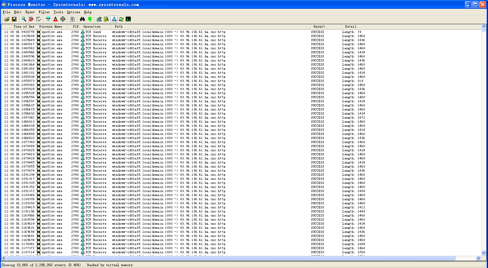
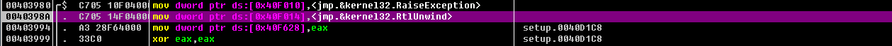
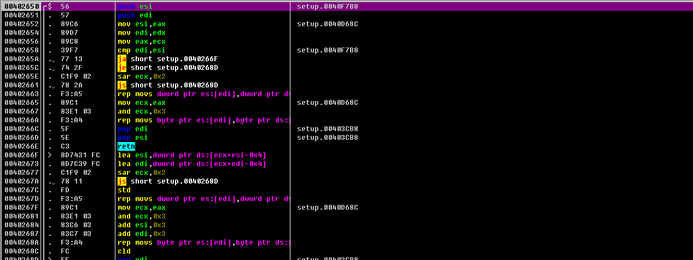
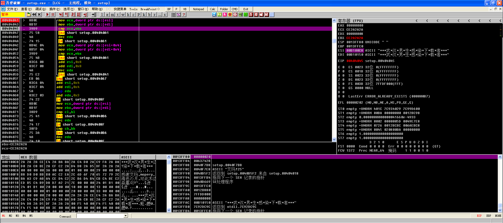
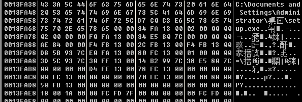
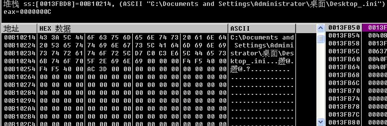
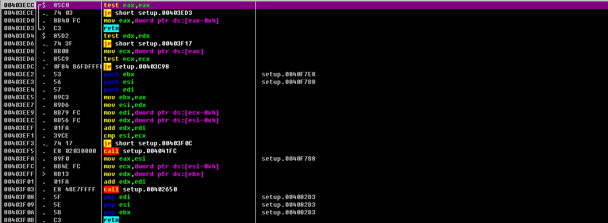
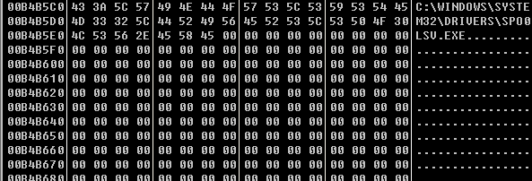
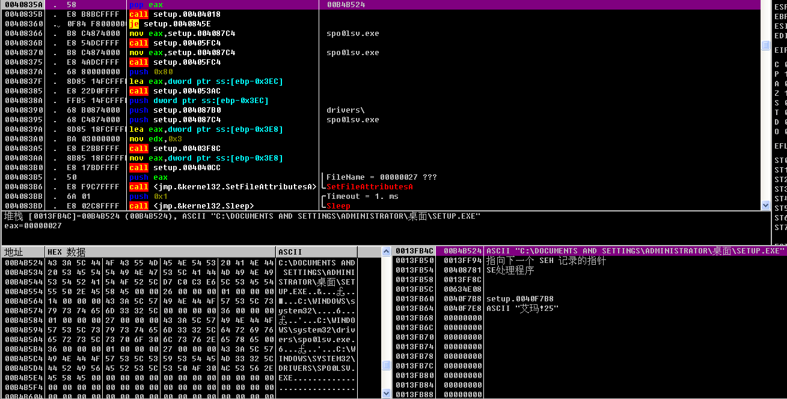

# 熊猫烧香样本分析（1）：setup.exe

# 一、准备工作
首先我们需要准备：

1.熊猫烧香病毒样本（信息如下）

文件：	C:\Documents and Settings\Administrator\桌面\setup.exe

大小：	30, 001 字节

修改时间：2007-01-17 12:18:40

_MD5：	512301C535C88255C9A252FDF70B7A03_

_SHA1：	CA3A1070CFF311C0BA40AB60A8FE3266CFEFE870_

_CRC32：E334747C_

> 注意：后三条数据为校验值，相当于病毒的指纹
>

2.一个VMware->Windows XP虚拟机

3.吾爱工具破解包

4.IDA Pro

5.OD

6.PE View

说说我为什么选用的虚拟机为Windows XP而不是Windows 7：

> 在《逆向工程核心原理》的第41章 ASLR写到：
>
> ASLR（Address Space Layout Randomization,地址空间布局随机化）是一种针对缓冲区溢出的安全保护技术，微软从Windows Vista开始采用该技术......借助ASLR技术，PE文件每次加载到内存的起始地址都会随机变化，并且每次运行程序时相应进程的栈以及堆的起始地址也会随机改变。也就是说，每次EXE文件运行时加载到进程内存的实际地址都不同，最初加载DLL文件时装载到内存中的实际地址也是不同的。
>
> 微软改用这种方式加载PE文件的原因何在呢？是为了增加系统安全性。大部分Windows OS安全漏洞（一般为缓冲区溢出）只出现在特定OS、特定模块、特定版本中。以这些漏洞为目标的漏洞利用代码（exploit code)中，特定内存地址以硬编码形式编入（因为在以前的OS中，根据OS版本的不同，特定DLL总是会加载到固定地址）。因此，微软采用了这种ASLR技术，增加了恶意用户编写漏洞利用代码的难度，从而降低了利用OS安全漏洞破坏系统的风险（UNIX/LinuxOS等都已采用了ASLR技术）......请注意，并不是所有可执行文件都自动应用ASLR技术。如上所述，OS的内核版本必须为6以上，并且使用的编程工具（如：VC++）要支持/DYNAMICBASE选项。
>

总的来说：使用Windows XP虚拟机是为了避免病毒样本采用ASLR技术从而导致逆向分析的复杂化，那时候Windows Vista已经发布（虽然这两者的时间间隔非常短...）

# 二、熊猫烧香的背景和基本信息
来自百度百科：

熊猫烧香其实是一种[蠕虫病毒](https://baike.baidu.com/item/%E8%A0%95%E8%99%AB%E7%97%85%E6%AF%92)的变种，而且是经过多次变种而来的，由于中毒电脑的[可执行文件](https://baike.baidu.com/item/%E5%8F%AF%E6%89%A7%E8%A1%8C%E6%96%87%E4%BB%B6)会出现“熊猫烧香”图案，所以也被称为 “熊猫烧香”病毒。但[原病毒](https://baike.baidu.com/item/%E5%8E%9F%E7%97%85%E6%AF%92)只会对EXE图标进行替换，并不会对系统本身进行破坏。而大多数是中等病毒变种，用户电脑中毒后可能会出现[蓝屏](https://baike.baidu.com/item/%E8%93%9D%E5%B1%8F)、频繁[重启](https://baike.baidu.com/item/%E9%87%8D%E5%90%AF)以及系统硬盘中数据文件被破坏等现象。同时，该病毒的某些变种可以通过[局域网](https://baike.baidu.com/item/%E5%B1%80%E5%9F%9F%E7%BD%91)进行传播，进而感染局域网内所有计算机系统，最终导致企业局域网瘫痪，无法正常使用，它能感染系统中[exe](https://baike.baidu.com/item/exe)，[com](https://baike.baidu.com/item/com)，[pif](https://baike.baidu.com/item/pif)，[src](https://baike.baidu.com/item/src)，[html](https://baike.baidu.com/item/html)，[asp](https://baike.baidu.com/item/asp)等文件，它还能终止大量的反病毒软件进程并且会删除扩展名为[gho](https://baike.baidu.com/item/gho)的备份文件。被感染的用户系统中所有.exe可执行文件全部被改成熊猫举着三根香的模样。

> 
>

# 三、熊猫烧香的中毒表现
注意：由于熊猫烧香有许多变种，以下行为均针对上述样本

首先我们备份一下虚拟机的快照，方便中毒之后恢复。为了方便观察病毒的行为，可以在控制面板的文件夹选项中进行设置：

1.取消勾选->隐藏受保护的操作系统文件

2.取消勾选->显示系统文件夹的内容

3.隐藏文件和文件夹->显示所有文件和文件夹

4.取消勾选->隐藏已知文件类型的扩展名

然后单击确定，结果如下图所示：

桌面的文件：

再看一下C盘的根目录：

运行病毒之后，我们可以在任务管理器中看到十分显眼的spo0lsv.exe进程（ spoolsv.exe：Windows OS自带的打印服务程序）

事实上还有一个setup.exe的进程，用来释放和运行spo0lsv.exe，完成后自动结束自身进程，用时非常短，很难观察到。（任务管理器可以正常打开，但之后会被病毒自动结束进程）

回到C盘根目录下：多出了两个文件：

我们打开autorun.inf文件，如下图，这个文件存在的意义是：当在我的电脑中打开某个磁盘时，会自动执行磁盘根目录下的setup.exe

> 
>

虚拟机中装有360压缩，我们去它的安装目录看下：（注：由于图表缓存没有刷新，桌面上仍显示的是原360压缩的图标）

双击并运行360zip.exe，程序仍然可以正常运行，图标由“熊猫烧香”变为“程序原图标”，并且文件夹中多出来Desktop_.ini的文件，打开记录着系统中毒时间：2020-3-4

> 
>

查看系统自启动项，在运行中输入：msconfig，回车打开：

病毒将自身添加到启动项中，和操作任务管理器的行为相同：每隔几秒自动结束“系统配置实用工具”窗口

最直观的行为大概就这么多，还原刚刚备份的虚拟机快照

# 四、熊猫烧香的行为分析
## 1、监控setup.exe
接下来我们使用工具“ProcessMonitor”开始行为分析

> ProcessMonitor下载链接：[https://docs.microsoft.com/en-us/sysinternals/downloads/procmon](https://docs.microsoft.com/en-us/sysinternals/downloads/procmon)
>

## ①删除共享
来到虚拟机的初始环境“中毒之前”，打开“ProcessMonitor”，如下图所示：

病毒的名称为setup.exe，因此它的进程名称也为setup.exe，在ProcessMonitor对Filter（过滤器）进行设置如下

> ProcessMonitor->Filter（过滤器）->Filter..
>

然后点击Add->ok，保存过滤器设置，运行病毒

如上图，可以看到ProcessMonitor捕获了非常多的病毒信息，看一下病毒的进程树：（Tools->Process Tree）

setup.exe是原始的病毒程序，由它衍生出来一个位置为：C:\WINDOWS\system32\drivers的spo0lsv.exe进程，而这个进程两次打开cmd.exe运行DOS命令：

1、cmd.exe /c net share C$ /del /y

2、cmd.exe /c net share admin$ /del /y

第一条命令主要使用于删除C盘的共享（若存在其他的分区，也会删除其他盘的共享）

第二条命令主要使用于删除系统根目录的共享

**总结一下：setup.exe释放****spo0lsv.exe，****spo0lsv.exe执行cmd命令删除共享**

## ②修改注册表
因为ProcessMonitor出现了很多的结果，接下来我们回到主界面，只保留注册表的监控：

还是有很多的结果，筛选一下：Filter（过滤器）->Filter..，设置结果如下：

然后点击Add->ok，保存过滤器设置

可以看到setup.exe对注册表的修改只有一项，seed这一项主要用于随机数种子的生成，由此我们可以知道setup.exe并没有对注册表造成实质性的影响。

## ③释放并运行spo0lsv.exe
创建文件是病毒的主要行为，接下来看文件的监控，如下图：

设置筛选器：Filter（过滤器）->Filter..（可以把之前关于注册表的筛选选项删除），如下图所示

> 删除：remove
>

然后点击Add->ok，保存过滤器设置

过滤的结果还是很多，先大致浏览一下可以发现，setup.exe在C:\WINDOWS\system32\drivers下创建了spo0lsv.exe文件，其他就好像没有什么...

> 成功：success
>

总结一下：setup.exe对系统没有多大的影响，有理由相信对系统造成破坏的应为spo0lsv.exe

## 2、监控spo0lsv.exe
在筛选器中可以把之前的有关setup.exe监控删掉，设置如下图：

然后点击Add->ok，保存过滤器设置

## ①删除注册表
看看spo0lsv.exe删除的注册表中的项，设置如下图

然后点击Add->ok，保存过滤器设置

浏览一下发现，spo0lsv.exe要删除的大部分都是杀毒软件的自启动注册表项（CurrentVersion\Run），接下来看看它创建了那些项和设置了哪些值（将Operation的RegDeleteValue筛选项删除，以免影响）

然后点击Add->ok，保存过滤器设置，发现spo0lsv.exe创建了svcshare的自启动项，这和前面的观察相呼应。

在后面的detail中可以找到创建自启动项文件的本体位置：

还是spo0lsv.exe

再看：HKLM\SOFTWARE\Microsoft\Windows\CurrentVersion\Explorer\Advanced\Folder\Hidden\SHOWALL

HKLM\SOFTWARE\Microsoft\Windows\CurrentVersion\Explorer\Advanced\Folder\Hidden\SHOWALL\CheckedValue

添加这两项注册表后，即使我们在文件夹选项中“显示所有文件和文件夹”，但还是无法显示spo0lsv.exe（除非你在文件夹选项当中没有勾选“隐藏受保护的操作系统文件”）

## ②操作文件
下面我们看一下spo0lsv.exe对文件的操作（将注册表的所有筛选项删除）

然后点击ok，保存过滤器设置。

浏览筛选项就会发现，它在C盘的根目录下创建了setup.exe、autorun.inf和Desktop_.ini，由于在前面我们发现病毒会隐藏文件，我们有理由详细，它创建的setup.exe、autorun.inf和Desktop_.ini也是具有隐藏属性的（事实证明也是如此）

> 创建autorun.inf是用于病毒的启动
>

## ③局域网传播
接下来我们看一下对网络的操作：

可以病毒发现不断的访问windows-cd81a85.localdomain:1083 -> 83.96.136.61.ha.cnc:http类似的网站，说白了就是不断尝试连接局域网，企图通过局域网来进行传播。

> 总结一下上述病毒的行为：
>
> 1.该病毒在路径C:\WINDOWS\system32\drivers创建了一个名为“spoclsv.exe”的进程
>
> 2.终止任务管理器和注册表的运行，创建autorun.inf使得无法打开磁盘（用于病毒的启动）
>
> 3.在HKEY_CURRENT_USER\Software\Microsoft\Windows\CurrentVersion\Run键项中添加svcshare，用于在开机时启动位于在系统目录下面的创建的spoclsv.exe
>
> 4.HKLM\SOFTWARE\Microsoft\Windows\CurrentVersion\Explorer\Advanced\Folder\Hidden\SHOWALL中的CheckedValue的键值设置为0，进行文件隐藏，防止用户查看释放的病毒
>
> 5.创建autorun.inf、Desktop_.ini、setup.exe，这些文件属性均为隐藏
>

## 3、流程图
除上述行为外，其实样本还有与网络进行加密通信的功能、感染U盘等，我在网络上找到了样本的执行流程图：（[https://bbs.pediy.com/thread-217802.htm](https://bbs.pediy.com/thread-217802.htm)）

### 第一部分（自我保护与自我复制）：
复制自身到系统目录、双击被感染程序可以检测判断spclosv.exe是否存在，从被感染的文件分裂出病毒程序重新执行

### 第二部分（感染部分）：
感染全盘（本地）、定时器感染全盘（本地）、局域网感染（联网）

### 第三部分(病毒自我保护)：
设置注册表、停止杀软、网站下载代码并执行

# 五、熊猫烧香的PE文件分析
## 1、查壳
运行吾爱破解工具包中的PEID和Exeinfo PE，将文件分别载入，结果如下：

提示有FSG v2.0的壳，并且Detect It Easy中显示样本是由Delphi编写的

## 2、手动脱壳
（[https://www.52pojie.cn/thread-1058671-1-1.html](https://www.52pojie.cn/thread-1058671-1-1.html)）

（[http://www.mamicode.com/info-detail-2321519.html](http://www.mamicode.com/info-detail-2321519.html)）

将exe文件拖入到OD中，往下拖动鼠标，发现代码不多，使用单步法脱壳

.当运行到4001D1时，看到有特殊的跳转，0040D278应该就是样本的OEP了，在按f8跳到OEP处,并按 Ctrl + A 强制分析

在0040D278处，Dump此处内存

OD->插件->OllyDump->脱壳在当前调试的进程 设置选项如下图：

确定，另存为1.exe，尝试运行一下，出现错误：

报错.0xC0000005.内存访问异常,应该是壳对导出表做了处理,导致我们dump下来的内存有错误，接下来进行修复。

在调试器中上下浏览一下代码,看到有直接调用的函数.进去查看,知道此处就是调用的原始IAT函数

确定好OEP后,我们使用Scylla x86这个工具来进行操作：

打开吾爱破解工具包中的Scylla x86，附加活动进程setup.exe，填写OEP为“0040D278”，自动查找IAT，若出现下面弹窗则选否，然后选择ok.

再点击获取输入表，结果如下：

转储到文件，保存为“setup_dump.exe”，然后修复转储的文件，选择“setup_dump.exe”，修复后会自动保存为“setup_dump_SCY.exe”，完成  
        文件：	C:\Documents and Settings\Administrator\桌面\setup_dump_SCY.exe

大小：	98, 816 字节

修改时间：2020-03-05 11:01:21

MD5：	B02BB3AA2F0A6876203B3EFAADD27B7D

SHA1：	0E02195427EDFED0F070F1B8465C14D01729A0A8

CRC32：7E50945E

再次查壳，无壳，脱壳成功！关闭OD，备份虚拟机快照（此时病毒没有运行），试试病毒是否可以正常运行，然后还原快照

## 3、脱壳后的PE结构分析
将脱壳后的“setup_dump_SCY.exe”重命名为“setup.exe”，将“setup.exe”载入到PE View中

首先我们看看“熊猫烧香”的IAT（Import Address Table，导入地址表），IMAGE_IMPORT_DESCRIPTOR结构体中记录着PE文件要导入哪些库文件。

> **简言之，IAT是一种表格，用来记录程序正在使用哪些库中的哪些函数。**
>

那么，MAGE_IMPORT_DESCRIPTOR结构体数组究竟存在于PE文件的哪个部分呢?

IMAGE_IMPORT_DESCRIPTOR结构体数组也被称为IMPORT Directory Table，所以我们只要查看PE文件的IMPORT Directory Table就可以了：

| kernel32.DLL | 控制着系统的内存管理、数据的输入输出操作和中断处理。 |
| --- | --- |
| user32.DLL | 用于包括Windows处理，基本用户界面等特性，如创建窗口和发送消息。 |
| advapi32.DLL | 包含的函数与对象的安全性，注册表的操控以及事件日志有关。 |
| oleaut32.DLL | 是对象链接与嵌入OLE相关文件。 |
| mpr.DLL | 是Windws操作系统网络通讯相关模块。 |
| wsock32.DLL | 用于支持Internet和网络应用程序。Windows和需要执行TCP/IP网络通信的应用程序会调用动态链接库wsock32.dll。 |
| wininet.DLL | wininet.dll是Windows应用程序网络相关模块。 |
| netapi32.DLL | netapi32.dll是Windows网络应用程序接口，用于支持访问微软网络，不可或缺。 |
| urlmon.DLL | 是微软Microsoft对象链接和嵌入相关模块。 |

# 六、动静调试
## 调试前夕
（[http://www.mamicode.com/info-detail-2321519.html](http://www.mamicode.com/info-detail-2321519.html)）

如上图所示，由于样本的ImageBase为00400000，因此PE装载器会将程序加载到00400000处:

加载到内存的PE映像可以在Win Hex相照应：

将实体机中的“setup.vir”载入到IDA中，找到程序的入口点：start，查看它的伪代码（F5）：

（扩展名改为“vir”是为了防止误操作）

`// write access to const memory has been detected, the output may be wrong!`

`void __noreturn start()`

`{`

` int v0; // ecx`

` char v1; // zf`

` int v2; // ecx`

` unsigned int v3; // [esp-Ch] [ebp-2Ch]`

` void *v4; // [esp-8h] [ebp-28h]`

` int *v5; // [esp-4h] [ebp-24h]`

` int v6; // [esp+8h] [ebp-18h]`

` int v7; // [esp+Ch] [ebp-14h]`

` int savedregs; // [esp+20h] [ebp+0h]`

` v6 = 0;`

` v7 = 0;`

上面定义了一些变量，再看OD，在程序的一开始就形成了栈帧：

## 练习程序调试1：call 0040D278->call 004049E8
接下来练习程序调试，在OD中单步步入（F7）到call 004049E8内部，如下图所示：

IDA也跟进：

`// write access to const memory has been detected, the output may be wrong!`

`int sub_4049E8()`

`{`

` int v0; // ecx`

` TlsIndex = 0;`

` dword_40F650 = (int)GetModuleHandleA(0);`

` dword_40E0B8 = 0;`

` dword_40E0BC = 0;`

` dword_40E0C0 = 0;`

` sub_4049DC();`

` return sub_403980(v0, &dword_40E0B4);`

`}`

> 百度百科：GetModuleHandle是一个计算机函数，功能是获取一个应用程序或动态链接库的模块句柄。只有在当前进程的场景中，这个句柄才会有效。
>

当单步步过地址：4049F4的call 00404924后，寄存器的EAX被赋值了地址0040000，继续向下：

可以看到经过上面四步的操作后eax中的地址0040000被写入到了地址0040E0B8处：（注意小端序）

也就是说地址0040E0B8处保存了数值（地址）00400000，数值（地址）00400000指向内存中PE文件的影响

然后xor eax eax（清空寄存器eax），继续单步走

步骤和上面重复，将地址40E0BC和40E0C0处的数据清零，结果如下：

接下来就call 004049DC，单步步入（F7），看一下IDA：

_DWORD *sub_4049DC()

{

 return sub_4046F0(&dword_40E0B4);

}

在看一下OD中：

也就是说，将地址0040E0B4赋值给eax，

## 练习程序调试2：call 004049E8->call 004046F0
然后单步步入call 004046F0

第一步：将地址40E028中的值“00000000”赋给edx，然后执行了汇编指令“mov dword ptr ds:[eax],edx”（将00000000赋值给段地址为ds（当前ds=0），偏移地址为eax“0040E0B4”的地址中，也就是说将0000000复制到地址0040E0B4处），最后的到地址0040E028地址处的值为0040E028，如下图：

> **前面的ds值一直为0**
>

然后返回到地址00404A1B处，保存一下当前的状态：

继续向下走：

第一步，将地址0040E0B4写入到EDX中，然后又复制到了eax中。最后call 00403980，步入。

## 练习程序调试3：call 004046F0->call 00403980

首先将两个“跳转到kernel32.dll中函数的地址”分别保存到了40F010、40F014处，将eax“0040D1C8”保存到0040F628中，清空eax，如下图

继续：

第一个是将地址eax（00000000）放入到0x40F62C、将edx（0040E0B4）放入到0x40F630。

执行完：mov eax,dword ptr ds:[edx+0x4]后，在寄存器中出现了“MZ”，解释一下：（edx+0x4）中保存着地址0040000，而地址00400000保存着MZ：

最后执行mov dword ptr ds:[0x40F01C],eax（将eax=00400000放入到0x40F01C中），如下

## 练习程序调试4：call 00403980->call 00403878
F7步入call 00403878

和前面基本相似，不说了，将执行流跳转到地址0040D292处（也就是call 004049E8的下一条），结束调试练习

> LEA是微机8086/8088系列的一条指令，取自英语Load effective address——取[有效地址](https://baike.baidu.com/item/%E6%9C%89%E6%95%88%E5%9C%B0%E5%9D%80/10202264)，也就是取[偏移地址](https://baike.baidu.com/item/%E5%81%8F%E7%A7%BB%E5%9C%B0%E5%9D%80/3108819)。在微机8086/8088中有20位[物理地址](https://baike.baidu.com/item/%E7%89%A9%E7%90%86%E5%9C%B0%E5%9D%80/2129)，由16[位段](https://baike.baidu.com/item/%E4%BD%8D%E6%AE%B5)基址向左偏移4位再与偏移地址之和得到。地址传送指令之一。
>

## 感染前夕
### call 00403C98
继续单步到地址0040D2D9处，步入call 00403C98，一番跟踪下来，并没有明白call 00403C98的用意，我们先放一放。

### call 00405250
下面基本上都是call 00403C98，我们直接来到地址0040D5E0的call 00405250处，单步步入：

emmmm，有许多局部变量：local，在IDA中查看：

> OD中的[[LOCAL](https://www.baidu.com/s?wd=LOCAL&tn=SE_PcZhidaonwhc_ngpagmjz&rsv_dl=gh_pc_zhidao)]就是局部变量的意思
>

好像是某种算法，在这里我们遇到函数就直接步过，然后就遇到了上图中的Do-While循环，在OD里反复执行后，证实这个循环为解密字符串：

注意视频中右下角的栈窗口：

[此处为语雀卡片，点击链接查看](https://www.yuque.com/cyberangel/rg9gdm/hei6hr#bEhgB)

### call 00405250->call 00403C98
来到地址0040530D处，进入call 00403C98

### call 00405250->call 00403C98->call 00403D08->...->call 00401860
执行到地址00403C98的call 00403D08，之后一直单步步入，直到00401860：

如上图所示，00401860调用了两个api函数：

00401876   .  E8 39F9FFFF   call <jmp.&kernel32.InitializeCriticalSection>        ; \InitializeCriticalSection

004018B3   .  E8 DCF8FFFF   call <jmp.&kernel32.LocalAlloc>                       ; \LocalAlloc

这两个api函数是对内存进行整理与分配

第一个参数是分配FF8大小的内存，第二个是分配固定的内存，

#### call 00403D08的功能：对内存进行整理与分配
### call 00405250->call 00403C98->call 00402650
接下来继续分析地址403CB3处的call 00402650，单步步入：

让IDA也进入：

看起来好像又是一段算法，在OD中注意到：rep movs dword ptr es:[edi],dword ptr ds:[esi]

> rep movs：复制内存空间
>

执行完rep movs dword ptr es:[edi],dword ptr ds:[esi]后，发现 es:[edi]地址处出现字符串“武汉男生感染下载者”，因此call 00402650的作用就是进行字符串的复制

#### call 00402650的作用为进行字符串的复制
### call 00404018
到此，call 00403C98分析到此结束，来到地址为0040D5ED的call 00404018，单步步入前的窗口如下：

现在单步步入：

其中，又出现了一个循环，那么我们着重分析一下这个循环，让流执行到404045处，我们看一下数据窗口：

如上图所示，404045处将ebx与ecx进行对比：一个是原始的“武汉男生感染下载者”，另一个是解密之后的“武汉男生感染下载者”，单步执行循环，可以在寄存器窗口中发现比对的流程。

所以地址为0040D5ED的call 00404018的功能是字符串对比。

#### call 00404018的功能是字符串对比。
由于字符串相同，所以0040D5F2的je short 0040D5FD实现跳转，来到0040D60A处的call 00405250，前面我们见过它，这里不再细说。

经过一步一步跟踪后，之前的代码对于病毒自身，来说只是相当于初始化的过程，对系统没有太大的危害，事实表明也是如此，接下来我们继续分析。

着重分析三个call：

0040D627    . E8 70ABFFFF   call setup.0040819C

0040D62C   .  E8 5BFBFFFF   call setup.0040D18C

0040D631   .  E8 52FAFFFF   call setup.0040D088

### call 0040819C
在IDA中进入 call setup.0040819C，主要代码如下：

`v61 = &savedregs;`

` v60 = &loc_408781;`

` v59 = __readfsdword(0);`

` __writefsdword(0, (unsigned int)&v59);`

` sub_40277C(this, &v82);`

` sub_405574(v1, &v83);`

` sub_403ED4(v2, "Desktop_.ini");`

` if ( (unsigned __int8)sub_405694() )`

` {`

`   sub_40277C(v3, &v80);`

`   sub_405574(v4, &v81);`

`   sub_403ED4(v5, "Desktop_.ini");`

`   v6 = (const CHAR *)sub_4040CC();`

`   SetFileAttributesA(v6, 0x80u);`

`   Sleep(1u);`

`   sub_40277C(v7, &v78);`

`   sub_405574(v8, &v79);`

`   sub_403ED4(v9, "Desktop_.ini");`

`   v10 = (const CHAR *)sub_4040CC();`

`   DeleteFileA(v10);`

` }`

` sub_40277C(v3, &v77);`

` sub_407650(v11, &v89);`

` sub_403C44();`

` for ( i = ((int (*)(void))sub_403ECC)(); i > 0 && *(_BYTE *)(v89 + i - 1); --i )`

` {`

`   v14 = v89;`

`   LOBYTE(v14) = *(_BYTE *)(v89 + i - 1);`

`   sub_403E2C(v12, v14);`

`   sub_403F18(v88, v76);`

` }`

` if ( !v88 )`

` {`

`   sub_40277C(v12, &v74);`

`   sub_40521C(v15, &v75);`

`   sub_4053AC(v75);`

`   sub_403F8C(v16, 3, "spo0lsv.exe", "drivers\\", v72);`

`   sub_40521C(v17, &v73);`

`   sub_404018(v18, v73);`

`   if ( !v19 )`

`   {`

`     sub_405FC4();`

`     sub_405FC4();`

`     sub_4053AC(128);`

`     sub_403F8C(v20, 3, "spo0lsv.exe", "drivers\\", v71);`

`     v21 = (const CHAR *)sub_4040CC();`

`     SetFileAttributesA(v21, v56);`

`     Sleep(1u);`

`     sub_4053AC(0);`

`     sub_403F8C(v22, 3, "spo0lsv.exe", "drivers\\", v70);`

`     v23 = (const CHAR *)sub_4040CC();`

`     sub_40277C(v24, &v69);`

`     v25 = (const CHAR *)sub_4040CC();`

`     CopyFileA(v25, v23, v53);`

`     sub_4053AC(1);`

`     sub_403F8C(v26, 3, "spo0lsv.exe", "drivers\\", v68);`

`     v27 = (const CHAR *)sub_4040CC();`

`     WinExec(v27, v28);`

`     ExitProcess_0(0);`

`   }`

` }`

` v29 = ((int (*)(void))sub_403ECC)();`

` sub_40416C(v29, i);`

` v49 = sub_4041B4(v48, v88);`

` if ( v49 > 0 )`

` {`

`   sub_4041B4(v50, v88);`

`   sub_40412C(&v85);`

`   sub_40416C(5, 1);`

`   sub_4041B4(v30, v85);`

`   sub_40412C(&v87);`

`   v32 = sub_4041B4(v31, v85);`

`   sub_40416C(v32, 1);`

`   v84 = sub_405760();`

`   v57 = __readfsdword(0);`

`   __writefsdword(0, (unsigned int)&v57);`

`   sub_402AD8(v33, v87, v57, &loc_40857A, &savedregs);`

`   byte_40E00C = 2;`

`   sub_402868();`

`   sub_402614();`

`   ((void (*)(void))sub_403ECC)();`

`   sub_40412C(&v67);`

`   sub_404260(v34, v67);`

`   sub_402B88();`

`   sub_402614();`

`   sub_402C48();`

`   sub_402614();`

`   __writefsdword(0, v57);`

`   sub_407B68();`

`   if ( !(unsigned __int8)sub_405458() )`

`   {`

`     sub_4053AC(128);`

`     sub_403F8C(v35, 3, "spo0lsv.exe", "drivers\\", v66);`

`     v36 = (const CHAR *)sub_4040CC();`

`     SetFileAttributesA(v36, v56);`

`     Sleep(1u);`

`     sub_4053AC(v57);`

`     sub_403F8C(v37, 3, "spo0lsv.exe", "drivers\\", uCmdShow);`

`     v38 = (const CHAR *)sub_4040CC();`

`     DeleteFileA(v38);`

`     v39 = ((int (*)(void))sub_403ECC)();`

`     sub_40416C(v84, v39 - v84);`

`     v40 = ((int (*)(void))sub_403ECC)();`

`     v41 = sub_403ECC(v40);`

`     sub_40416C(v55, v41);`

`     sub_403CDC(v42, v89);`

`     v55 = &savedregs;`

`     v54 = &loc_408730;`

`     v53 = __readfsdword(0);`

`     __writefsdword(0, (unsigned int)&v53);`

`     sub_4053AC(v53);`

`     sub_403F8C(v43, 3, "spo0lsv.exe", "drivers\\", v63);`

`     sub_402AD8(v44, v64, v56, v57, v58);`

`     byte_40E00C = 2;`

`     sub_402868();`

`     sub_402614();`

`     sub_404260(v45, v86);`

`     sub_402B88();`

`     sub_402614();`

`     sub_402C48();`

`     sub_402614();`

`     sub_4053AC(1);`

`     sub_403F8C(v46, 3, "spo0lsv.exe", "drivers\\", v62);`

`     v47 = (const CHAR *)sub_4040CC();`

`     WinExec(v47, v56);`

`     __writefsdword(0, v57);`

`   }`

`   ExitProcess_0(0);`

` }`

` __writefsdword(0, v59);`

` sub_403C68(v61, 29, &loc_408788);`

` return sub_403C68(v51, 5, v61);`

`}`

OD单步进入：

### call 0040819C->call 0040277C
形成栈帧后，开头将84赋值给了ecx，这可能说明循环的次数为84，之后执行了两次push 0，一个push可以获取8个字节的内存空间，共获取了16*84字节的空间，接下来单步步入call 0040277C，IDA也进入：

在IDA中发现调用了GetModuleFileNameA函数，这个功能主要是获取当前进程已加载模块的文件的完整路径，看一下OD

我们单步到地址004027A0处的call <jmp.&kernel32.GetModuleFileNameA>，看一下栈窗口：

其中PathBuffer中保存着0013FA38，跟随数据窗口（执行前）：

单步步过后：

可以看到已经获取了setup.exe文件的路径，因此call 40277C的作用大概就是获取样本的完整路径

#### call 40277C的作用是获取样本的完整路径
返回到004081CA的mov eax,dword ptr ss:[ebp-0x3B8]处，单步步过后跟随数据窗口发现eax变化为00B101D0，在数据窗口中跟随：

同理发现lea edx,dword ptr ss:[ebp-0x3B4]过后0013FBD8处数据为空：

### call 0040819C->call 00405574
接下来我们单步步入call 00405574：

可以看到call 405574中出现了循环，进入循环

> 调整局部变量的显示方式：[https://zhidao.baidu.com/question/918251002290002019.html](https://zhidao.baidu.com/question/918251002290002019.html)
>

循环的第一个是：mov eax,dword ptr ss:[ebp-0x4]

看一下数据窗口

再看一下地址00B101D0处是什么：

正好是样本的保存路径，继续F8，有：mov al,byte ptr ds:[eax+ebx-0x1]

eax指的是路径的保存地址：00B101D0，而ebx为00000036，那00000036，是什么，在数据窗口中向上微微拖动：

凡是由Delphi编写的程序，它在字符串减4的位置保存一个数值（00000036），这个数值为路径的长度，也就是说路径的长度保存在ebx中，那么eax+ebx-0x1指的就是路径的最后一个字母的位置：

继续向下走：有一系列的cmp对比：

看IDA：+

R键解析一下：

得出上述循环是从后向前进行检索，一直到冒号，斜杠，反斜杠结束；

这样就有两种可能性：

1、获取：C:\Documents and Settings\Administrator\桌面\

2、获取病毒文件名setup.exe

为了确定，我们跳出循环到004055BD的push esi，继续单步步过004055C8的call setup.0040412C，看一下数据窗口：

很明显，它获取：C:\Documents and Settings\Administrator\桌面\

#### call 00405574是为了获取病毒的路径
### call 00540819C->call 00403ED4
单步走004081D8的lea eax,dword ptr ss:[ebp-0x3B4]，它将不带文件名路径的地址（B10214）赋给了eax

mov edx,0x408798是将Desktop_.ini的地址（00408798）赋给EDX

直接单步步过004081E6的call setup.00403ED4：

可以看到call setup.00403ED4的作用为拼接字符串，

#### call 00403ED4的作用为拼接字符串
继续向下执行：mov eax,dword ptr ss:[ebp-0x3B4]后：观察寄存器：

### call 00540819C->call 00404594->call 0040562C
下面进入call 00405694继续步入call 0040562C，如下：

可见，这里调用的大量的api函数：

单步来到00405647地址处的call <jmp.&kernel32.FindFirstFileA>  （不执行），栈窗口

filename的参数保存在eax中，eax保存的正好就是路径的地址：C:\Documents and Settings\Administrator\桌面\Desktop_.ini，也就是说call <jmp.&kernel32.FindFirstFileA> 是要查找当前目录下的Desktop_.ini文件是否存在

#### call 0040562C主要来查找文件是否存在。
### call 0040819C->call 004040CC
接下来看：

test al,al是进行验证Desktop_.ini是否存在，如果存在，则跳转不发生执行setFileAttributesA来设置文件的属性为正常（push 0x80），停止1ms，最后将文件删除。

再看一下跳转中的call 004040CC，在ida中查看：

事实上：eax里存放的是路径的地址，test eax eax是为了验证路径是否存在

#### call 004040CC的作用是验证路径是否存在
接下来的call 40277C，刚刚见到过，它的作用是获取样本的完整路径。

地址408295的mov eax,dword ptr ss:[ebp-0x3CC]中的ss:[ebp-0x3CC]是样本的存放路径地址，如下图

它是将存放路径的地址赋值给了eax，然后执行了lea edx,dword ptr ss:[ebp-0x4]：

ebp-4的数据窗口如下：

### call 0040819C->call 00407650
由于call 407650之前有参数压入了eax和edx，我们直接步过call 407650，再看数据窗口：

发现地址0013FF88处写入了地址00B332D0，跟随此地址：

可以看到，这个函数将内存中的映像复制到了地址00B33310处

#### ？？call 00407650复制自身映像
### call 0040819C->call 00403C44
4082A3处有lea eax,dword ptr ss:[ebp-0x8]，跟随ebp-8：

步入call 00403C44，并没有发现什么特别的东西，执行完这个函数之后，发现处理器的标志位发生了变化：

#### call 00403C44的作用是设置标志位
### call 0040819C->call 00403ECC
地址004082AB的mov eax,dword ptr ss:[ebp-0x4]，跟踪一下ebp-0x4，发现保存着PE文件：

进入call 00403ECC

首先测试了eax是否为0，发现跳转并没有成立。

地址00403ED0的mov eax,dword ptr ds:[eax-0x4]，看一下eax-4的内容：

之前说过，由于程序是由Delphi编写的因此在字符串减4的位置就是字符串的长度“12800”，也就是说mov eax,dword ptr ds:[eax-0x4]是将字符串的长度保存在eax中

#### call 00403ECC的作用为保存PE文件长度
接下来的mov ebx,eax和test ebx,ebx将文件长度赋值给了ebx，之后测试ebx是否为0（正常文件的长度不为零），然后jle short 004082E9（跳转未实现），来到mov eax,dword ptr ss:[ebp-0x4]，它使eax重新指向PE文件的起始位置。之后的004082E2的cmp byte ptr ds:[eax+ebx-0x1],0x0：这条语句是比对PE文件的最后一个字符是否为0，如果为0，那么接下来的跳转不成立，

call 0040277C前面分析过，它获取样本的完整路径

mov eax,dword ptr ss:[ebp-0x3D8]：将文件路径的地址赋值给eax

lea edx,dword ptr ss:[ebp-0x3D4]，ebp-0x3D4的数据窗口如下：

### call 0040819C->call 0040521C
执行过后来到call 0040521C，步入，结合IDA分析：

> DWORD __fastcall sub_40521C(int a1, LPSTR *a2)
>
> {
>
>  LPSTR *v2; // edi
>
>  int v3; // ebx
>
>  int v4; // eax
>
>  DWORD result; // eax
>
>  v2 = a2;
>
>  v3 = sub_403ECC();
>
>  v4 = sub_4040CC();
>
>  result = sub_403D34(v3, v4);
>
>  if ( v3 > 0 )
>
>    result = CharUpperBuffA(*v2, v3);
>
>  return result;
>
> }
>

其中的函数几乎前面都分析过，注意CharUpperBuffA，这个API函数将缓冲区中指定书目的字符全部转换为大写字母

#### call 0040521C的作用为字符转为大写字母
### call 0040819C->call 004053AC
来到0040831E的call setup.004053AC

IDA看一下：

int __usercall sub_4053AC@<eax>(int *a1@<eax>)

{

 int *v1; // ebx

 int v2; // eax

 int result; // eax

 int v4; // ecx

 CHAR Buffer; // [esp+0h] [ebp-10Ch]

 v1 = a1;

 GetSystemDirectoryA(&Buffer, 0x104u);

 sub_403EB4(261, &Buffer);

 v2 = *v1;

 result = sub_403ECC();

 if ( *(_BYTE *)(*v1 + result - 1) != 92 )

   result = sub_403ED4(v4, &dword_405400);

 return result;

}

其中调用了GetSystemDirectoryA函数：这个函数能取得Windows系统目录(System目录)的完整路径

#### call 004053AC取得Windows系统目录(System目录)的完整路径
### call 0040819C->call 00403F8C
继续向下走，来到00408323处push dword ptr ss:[ebp-0x3E4]，在窗口中可以看到：

它是将系统的路径进行压栈，接下来分别将drivers\和spol0sv.exe压栈，猜测接下来的call 00403F8C是将上面的字符串进行连接。

看一下ebp-0x3E0的数据窗口：

步过call 00403F8C后：

#### call 00403F8C的作用是将字符串进行连接
### call 0040819C->call 0040521C
接下来的

### 
ebp-3E0是指向堆栈 ss:[0013FBAC]=00B4B58C, (ASCII "C:\WINDOWS\system32\drivers\spo0lsv.exe")，它将地址赋值给了eax；ebp-3DC的数据窗口如下：

步过call 0040521C之后：

跟随数值，存放着路径：

当然，我们可以重启OD来看一下call 0040521C：

其中的call 00403ECC：保存PE文件的长度；call 004040CC：验证路径是否存在；然后将路径改变为大写字母

#### call 0040521C的作用为对内存中路径的地址进行操作
接下来的mov edx,dword ptr ss:[ebp-0x3DC]同样指向路径地址(ASCII "C:\WINDOWS\system32\drivers\spo0lsv.exe")，赋值给了edx，然后将eax出栈，数据窗口如下：

eax出栈为C:\DOCUMENTS AND SETTINGS\ADMINISTRATOR\桌面\SETUP.EXE

接下来的call 00404018为字符串的对比：

C:\WINDOWS\SYSTEM32\DRIVERS\SPO0LSV.EXE

C:\DOCUMENTS AND SETTINGS\ADMINISTRATOR\桌面\SETUP.EXE

字符串肯定不相同，因此接下来的跳转没有实现。继续：

它将spp0lsv.exe保存在eax中，然后执行call 00405FC4

### call 0040819C->call 00405FC4
在IDA里看一下：

可见这个函数里面包含着许多call，如果一个一个call分析的话十分的麻烦，OD步入，窗口向下滑动：

可见，call调用了许多API函数，根据api函数的名称我们可以猜测这个函数的作用应该是查找进程中是否有spo0slv.exe，如果有就会结束掉此进程。

#### call 00405FC4的作用为查找进程中是否有spo0slv.exe，有就结束掉
### 返回call 0040819C

图中所有的函数都在前面分析过，病毒的流程可以参照API函数，这里大概说一下：函数将自身拷贝到了drivers目录下。

继续向下，地址00408451有CmdLine = "C:\WINDOWS\system32\drivers\spo0lsv.exe"和Winexec函数：

## 退出setup.exe
也就是将C:\WINDOWS\system32\drivers\spo0lsv.exe执行，之后就退出程序。

前面我们提到过：

> 接下来的call 00404018为字符串的对比：
>
> C:\WINDOWS\SYSTEM32\DRIVERS\SPO0LSV.EXE
>
> C:\DOCUMENTS AND SETTINGS\ADMINISTRATOR\桌面\SETUP.EXE
>
> 字符串肯定不相同，因此接下来的跳转没有实现。
>

修改此处跳转就可以让病毒以为自身就是DRIVERS\SPO0LSV.EXE的程序，可以将je改为jne（修改了程序代码，不推荐）或者改变zero flag将0改为1（推荐）

---

剩下的spo0slv.exe才是病毒的灵魂，有时间在分析，~~咕咕咕~~

~~目标：分析spo0slv.exe和PE文件结构（前面meiyourenzhenfenxi）~~

> 更新: 2020-04-11 17:17:26  
> 原文: <https://www.yuque.com/cyberangel/rg9gdm/hei6hr>