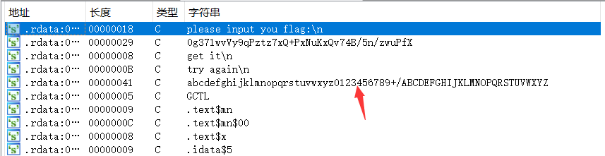
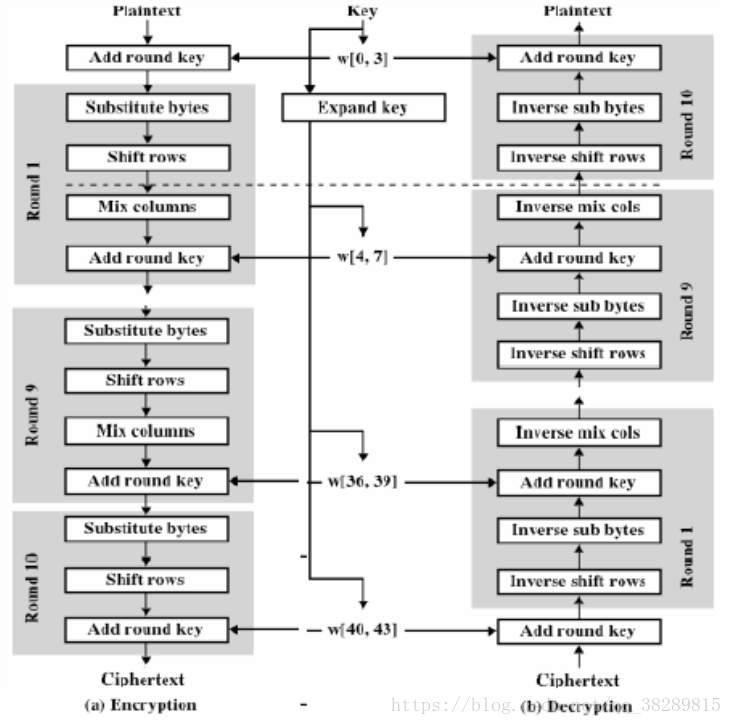
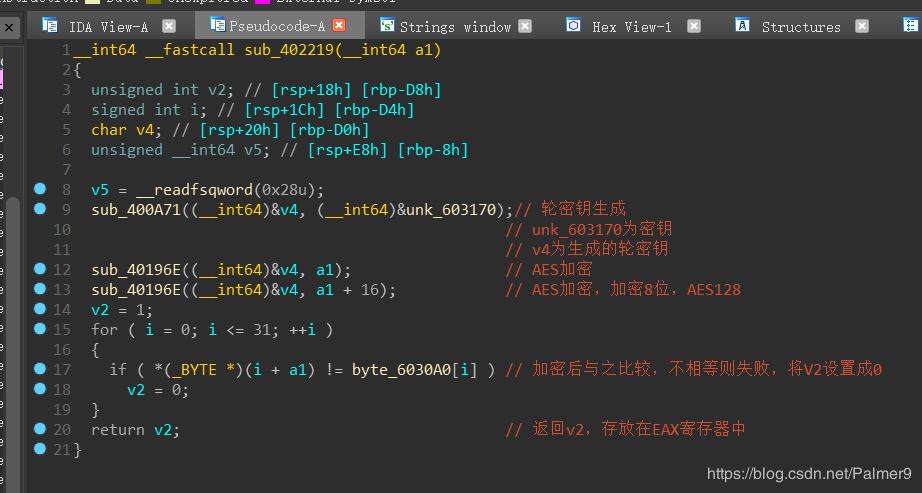
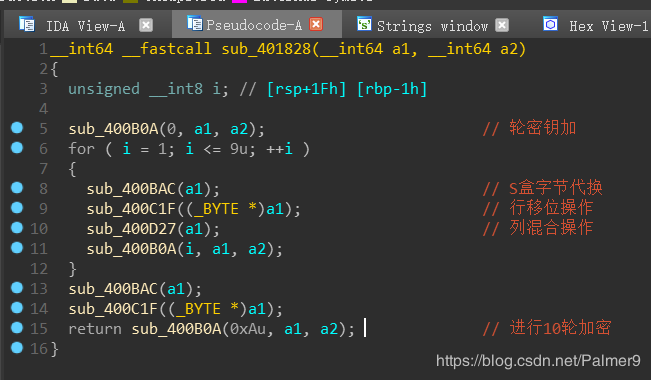
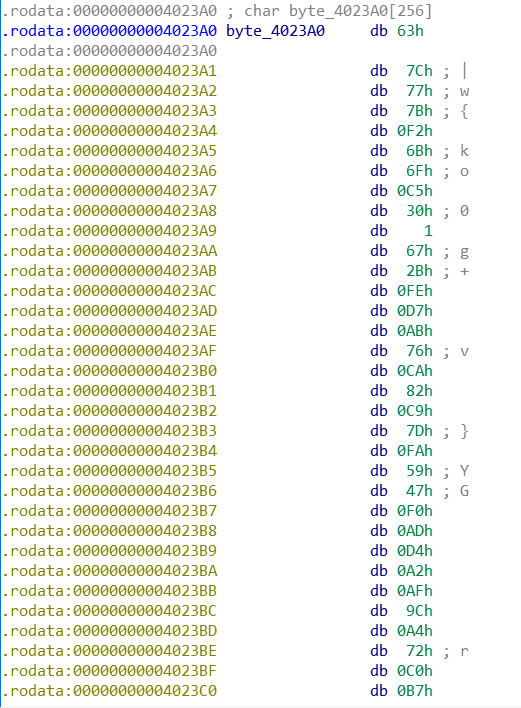

> 文章内容绝大部分来自：《CTF特训营》
>

# 1、base64及换表
base64主要是将输入的每3字节（共24bit）按照每六比特分成一组，变成4个小于64的索引值，然后通过一个索引表得到4个可见的字符。

索引表为一个64字节的字符串，如果在代码中发现引用了这个索引表“ABCDEFGHIJKLMNOPQRSTUVWXYZabcdefghijklmnopqrstuvwxyz0123456789+/”，那么基本上可以确定使用了base64。当然，如果和上面的索引表不相符但类型类似，比如：“abcdefghijklmnopqrstuvwxyz0123456789+/ABCDEFGHIJKLMNOPQRSTUVWXYZ”，基本上可以确定使用了base64换表。

我们以2020HGame-Week1-advance为例看一下IDA中base64的反编译伪代码：

[2020HGame-Week1-advance（base64换表）](https://www.yuque.com/cyberangel/vqcmca/kc0fdg)

将文件拖入IDA，搜索字符串，出现了标志性的索引表：



对字符串交叉引用我们可以看到它的伪代码：

```c
signed __int64 __fastcall sub_140001EB0(_BYTE *a1, __int64 a2, int a3)
{
  int v3; // er10
  __int64 v4; // rax
  __int64 v5; // rbx
  _BYTE *v6; // rdi
  _BYTE *v7; // r9
  signed __int64 v8; // r11
  unsigned __int64 v9; // rdx
  unsigned __int64 v10; // rax
  char v11; // cl

  v3 = 0;
  v4 = a3 - 2;
  v5 = a2;
  v6 = a1;
  v7 = a1;
  if ( v4 > 0 )
  {
    v8 = a2 + 1;
    v9 = ((unsigned __int64)((unsigned __int64)(v4 - 1) * (unsigned __int128)0xAAAAAAAAAAAAAAABui64 >> 64) >> 1) + 1;
    v3 = 3 * v9;
    do
    {
      v10 = *(unsigned __int8 *)(v8 - 1);
      v8 += 3i64;
      *v7 = aAbcdefghijklmn[v10 >> 2];
      v7[1] = aAbcdefghijklmn[((unsigned __int64)*(unsigned __int8 *)(v8 - 3) >> 4) | 16i64 * (*(_BYTE *)(v8 - 4) & 3)];
      v7[2] = aAbcdefghijklmn[4i64 * (*(_BYTE *)(v8 - 3) & 0xF) | ((unsigned __int64)*(unsigned __int8 *)(v8 - 2) >> 6)];
      v7[3] = aAbcdefghijklmn[*(_BYTE *)(v8 - 2) & 0x3F];
      v7 += 4;
      --v9;
    }
    while ( v9 );
  }
  if ( v3 < a3 )
  {
    *v7 = aAbcdefghijklmn[(unsigned __int64)*(unsigned __int8 *)(v3 + v5) >> 2];
    if ( v3 == a3 - 1 )
    {
      v11 = 61;
      v7[1] = aAbcdefghijklmn[16 * (*(_BYTE *)(v3 + v5) & 3)];
    }
    else
    {
      v7[1] = aAbcdefghijklmn[((unsigned __int64)*(unsigned __int8 *)(v5 + v3 + 1) >> 4) | 16i64
                                                                                         * (*(_BYTE *)(v3 + v5) & 3)];
      v11 = aAbcdefghijklmn[4 * (*(_BYTE *)(v5 + v3 + 1) & 0xF)];
    }
    v7[2] = v11;
    v7[3] = 61;
    v7 += 4;
  }
  *v7 = 0;
  return v7 - v6 + 1;
}
```

# 2、TEA
TEA算法是一种常见的分组加密算法，密钥为128比特位，明文为64比特位，主要做了32轮变换，每轮变换中都涉及移位和变换。TEA的源码如下：

```c
void encrypt(uint32_t *v, uint32_t *k)
{
    uin32_t v0 = v[0], v1 = v[1], sum = 0, i;
    uin32_t delta = 0x9e3779b9;
    uin32_t k0 = k[0], k1 = k[1], k2 = k[2], k3 = k[3];
    for (i = 0; i <= 32; i++)
    {
        sum += delta;
        v0 += ((v1 << 4) + k0) ^ (v1 + sum) ^ ((v1 >> 5) + k1);
        v1 += ((v0 << 4) + k2) ^ (v0 + sum) ^ ((v0 >> 5) + k3);
    }
    v[0] = v0;
    v[1] = v1;
}
void decrypt(uint32_t *v, uint32_t *k)
{
    uin32_t v0 = v[0], , v1 = v[1], sum = 0xc6ef3720, i;
    uin32_t delta = 0x9e3779b9;
    uin32_t k0 = k[0], k1 = k[1], k2 = k[2], k3 = k[3];
    for (i = 0; i <= 32; i++)
    {
        v1 -= ((v0 << 4) + k2) ^ (v0 + sum) ^ ((v0 >> 5) + k3);
        v0 -= ((v1 << 4) + k0) ^ (v1 + sum) ^ ((v1 >> 5) + k1);
    }
    v[0] = v0;
    v[1] = v1;
}
```

对TEA的识别也比较容易，**<font style="color:#F5222D;">在TEA算法中有一个固定的常数0x9e3779b9或者0x61c88647</font>**。

# 3、AES
AES也是常见的分组加密算法，多次出现在CTF中。AES的加解密流程如图所示：



AES加密过程涉及4中操作：字节替代（SubBytes）、行移位（ShiftRows）、列混淆（MixColumns）和轮密钥加（AddRoundKey）

其中，字节替代过程是通过S盒完成一个字节到另外一个字节的映射。S盒和逆S盒具体如下：

```c
static const uint32 FSb[256] = 
{
    0x63, 0x7c, 0x77, 0x7b, 0xf2, 0x6b, 0x6f, 0xc5, 0x30, 0x01, 0x67, 0x2b, 0xfe, 0xd7, 0xab, 0x76,
    0xca, 0x82, 0xc9, 0x7d, 0xfa, 0x59, 0x47, 0xf0, 0xad, 0xd4, 0xa2, 0xaf, 0x9c, 0xa4, 0x72, 0xc0,
    0xb7, 0xfd, 0x93, 0x26, 0x36, 0x3f, 0xf7, 0xcc, 0x34, 0xa5, 0xe5, 0xf1, 0x71, 0xd8, 0x31, 0x15,
    0x04, 0xc7, 0x23, 0xc3, 0x18, 0x96, 0x05, 0x9a, 0x07, 0x12, 0x80, 0xe2, 0xeb, 0x27, 0xb2, 0x75,
    0x09, 0x83, 0x2c, 0x1a, 0x1b, 0x6e, 0x5a, 0xa0, 0x52, 0x3b, 0xd6, 0xb3, 0x29, 0xe3, 0x2f, 0x84,
    0x53, 0xd1, 0x00, 0xed, 0x20, 0xfc, 0xb1, 0x5b, 0x6a, 0xcb, 0xbe, 0x39, 0x4a, 0x4c, 0x58, 0xcf,
    0xd0, 0xef, 0xaa, 0xfb, 0x43, 0x4d, 0x33, 0x85, 0x45, 0xf9, 0x02, 0x7f, 0x50, 0x3c, 0x9f, 0xa8,
    0x51, 0xa3, 0x40, 0x8f, 0x92, 0x9d, 0x38, 0xf5, 0xbc, 0xb6, 0xda, 0x21, 0x10, 0xff, 0xf3, 0xd2,
    0xcd, 0x0c, 0x13, 0xec, 0x5f, 0x97, 0x44, 0x17, 0xc4, 0xa7, 0x7e, 0x3d, 0x64, 0x5d, 0x19, 0x73,
    0x60, 0x81, 0x4f, 0xdc, 0x22, 0x2a, 0x90, 0x88, 0x46, 0xee, 0xb8, 0x14, 0xde, 0x5e, 0x0b, 0xdb,
    0xe0, 0x32, 0x3a, 0x0a, 0x49, 0x06, 0x24, 0x5c, 0xc2, 0xd3, 0xac, 0x62, 0x91, 0x95, 0xe4, 0x79,
    0xe7, 0xc8, 0x37, 0x6d, 0x8d, 0xd5, 0x4e, 0xa9, 0x6c, 0x56, 0xf4, 0xea, 0x65, 0x7a, 0xae, 0x08,
    0xba, 0x78, 0x25, 0x2e, 0x1c, 0xa6, 0xb4, 0xc6, 0xe8, 0xdd, 0x74, 0x1f, 0x4b, 0xbd, 0x8b, 0x8a,
    0x70, 0x3e, 0xb5, 0x66, 0x48, 0x03, 0xf6, 0x0e, 0x61, 0x35, 0x57, 0xb9, 0x86, 0xc1, 0x1d, 0x9e,
    0xe1, 0xf8, 0x98, 0x11, 0x69, 0xd9, 0x8e, 0x94, 0x9b, 0x1e, 0x87, 0xe9, 0xce, 0x55, 0x28, 0xdf,
    0x8c, 0xa1, 0x89, 0x0d, 0xbf, 0xe6, 0x42, 0x68, 0x41, 0x99, 0x2d, 0x0f, 0xb0, 0x54, 0xbb, 0x16 
};

```

```c
static const uint RSb[256] = 
{ 
    0x52, 0x09, 0x6a, 0xd5, 0x30, 0x36, 0xa5, 0x38, 0xbf, 0x40, 0xa3, 0x9e, 0x81, 0xf3, 0xd7, 0xfb,
    0x7c, 0xe3, 0x39, 0x82, 0x9b, 0x2f, 0xff, 0x87, 0x34, 0x8e, 0x43, 0x44, 0xc4, 0xde, 0xe9, 0xcb,
    0x54, 0x7b, 0x94, 0x32, 0xa6, 0xc2, 0x23, 0x3d, 0xee, 0x4c, 0x95, 0x0b, 0x42, 0xfa, 0xc3, 0x4e,
    0x08, 0x2e, 0xa1, 0x66, 0x28, 0xd9, 0x24, 0xb2, 0x76, 0x5b, 0xa2, 0x49, 0x6d, 0x8b, 0xd1, 0x25,
    0x72, 0xf8, 0xf6, 0x64, 0x86, 0x68, 0x98, 0x16, 0xd4, 0xa4, 0x5c, 0xcc, 0x5d, 0x65, 0xb6, 0x92,
    0x6c, 0x70, 0x48, 0x50, 0xfd, 0xed, 0xb9, 0xda, 0x5e, 0x15, 0x46, 0x57, 0xa7, 0x8d, 0x9d, 0x84,
    0x90, 0xd8, 0xab, 0x00, 0x8c, 0xbc, 0xd3, 0x0a, 0xf7, 0xe4, 0x58, 0x05, 0xb8, 0xb3, 0x45, 0x06,
    0xd0, 0x2c, 0x1e, 0x8f, 0xca, 0x3f, 0x0f, 0x02, 0xc1, 0xaf, 0xbd, 0x03, 0x01, 0x13, 0x8a, 0x6b,
    0x3a, 0x91, 0x11, 0x41, 0x4f, 0x67, 0xdc, 0xea, 0x97, 0xf2, 0xcf, 0xce, 0xf0, 0xb4, 0xe6, 0x73,
    0x96, 0xac, 0x74, 0x22, 0xe7, 0xad, 0x35, 0x85, 0xe2, 0xf9, 0x37, 0xe8, 0x1c, 0x75, 0xdf, 0x6e,
    0x47, 0xf1, 0x1a, 0x71, 0x1d, 0x29, 0xc5, 0x89, 0x6f, 0xb7, 0x62, 0x0e, 0xaa, 0x18, 0xbe, 0x1b,
    0xfc, 0x56, 0x3e, 0x4b, 0xc6, 0xd2, 0x79, 0x20, 0x9a, 0xdb, 0xc0, 0xfe, 0x78, 0xcd, 0x5a, 0xf4,
    0x1f, 0xdd, 0xa8, 0x33, 0x88, 0x07, 0xc7, 0x31, 0xb1, 0x12, 0x10, 0x59, 0x27, 0x80, 0xec, 0x5f,
    0x60, 0x51, 0x7f, 0xa9, 0x19, 0xb5, 0x4a, 0x0d, 0x2d, 0xe5, 0x7a, 0x9f, 0x93, 0xc9, 0x9c, 0xef,
    0xa0, 0xe0, 0x3b, 0x4d, 0xae, 0x2a, 0xf5, 0xb0, 0xc8, 0xeb, 0xbb, 0x3c, 0x83, 0x53, 0x99, 0x61,
    0x17, 0x2b, 0x04, 0x7e, 0xba, 0x77, 0xd6, 0x26, 0xe1, 0x69, 0x14, 0x63, 0x55, 0x21, 0x0c, 0x7d 
};

```

这里以BUUCTF-re-[GWCTF 2019]re3为例来看看AES加密：

> [https://blog.csdn.net/Palmer9/article/details/105034093/](https://blog.csdn.net/Palmer9/article/details/105034093/)
>

经过一系列的折腾之后，我们看看AES函数：





也可以发现AES的S盒：byte_4023A0



**<font style="color:#F5222D;">通过识别S盒，可以确定是AES加密</font>**

# 4、RC4加密
RC4加密算法属于流加密算法，包括初始化函数盒加解密函数，函数代码具体如下：

```c
//初始化函数
void RC4_Init(unsigned char* s, unsigned char* sey, unsigned long Len) {
    int i = 0, j = 0;
  //char k[256] = { 0 };
    unsigned char k[256] = { 0 };
    unsigned char tmp=0;
    for (i = 0; i < 256; ++i) {
        S[i] = i;//初始化S-box
        k[i] = key[i % Len];//密钥填充临时数组
    }
    //打乱S-box
    for (i = 0; i < 256; ++i) {
        j = (j + s[i] + k[i]) % 256;
        tmp = s[i];
        s[i] = s[j];//交换s[i]和s[j]
        s[j] = tmp;
    }
}
```

```c
//加解密
void RC4_Crypt(unsigned char* s, unsigned char* Data, unsigned long Len) {
    int i = 0, j = 0, t=0;
    unsigned long k = 0;
    unsigned char tmp;
    for (k = 0; k < Len; k++) {
        i = (i + 1) % 256;
        j = (j + s[i]) % 256;
        tmp = s[i];
        s[i] = s[j];//变换s[i]和s[j]
        s[j] = tmp;
        t = (s[i] + s[j]) % 256;
        Data[n] ^= s[t];
    }
}
```

可以看出，初始代码对字符数组s进行了初始化赋值，且赋值分别递增，之后有对s进行了256次变换操作。**<font style="color:#F5222D;">通过识别初始化代码，可以判断为RC4算法。</font>**

# 5、MD5
MD5消息摘要算法，是一种被广泛使用的密码散列函数，可以产生一个128位（16字节）的散列值，用于确保信息传输的完整性和一致性。MD5加密的函数大致如下：

MD5_CTX md5c;

MD5Init(&md5c);

MD5UpdateString(&md5c,plain)

MD5Final(digest,&md5c);

其中，MD5Init会初始化四个称作MD5链接变量的整形参数。</font>**<font style="color:#F5222D;">因此如果看到这4个常数0x67452301、0xefcdab89、0x98badcfe、0x10325476，就可以怀疑该函数是否为MD5算法了。</font>**

MD5Init函数代码如下：

```c
void MD5Init(MD5_CTX *context)  
{  
     context->count[0] = 0;  
     context->count[1] = 0;  
     //Load magic initialization constants
     context->state[0] = 0x67452301;  
     context->state[1] = 0xEFCDAB89;  
     context->state[2] = 0x98BADCFE;  
     context->state[3] = 0x10325476;  
}  
```

# 6、CRC32、64
[BUUCTF-RoarCTF2019-polyre（控制平坦化、反虚假控制流脚本、CRC64）](https://www.yuque.com/cyberangel/vqcmca/ccy1c4)

注意文章中的一句话：

**<font style="color:#F5222D;">（CRC64）加密原理实际上就是CRC32算法---输入一组长度48的字符串，每8个字节分为1组，共6组。对每一组取首位，判断正负。正值，左移一位；负值，左移一位，再异或0xB0004B7679FA26B3。重复判断操作64次，得到查表法所用的表。</font>**

# 7、SM4加密
[BUUCTF-安洵杯 2019-crackMe(hook、SM4加密，base64换表、极其难)](https://www.yuque.com/cyberangel/vqcmca/rgffk2)

待整理。。。


> 更新: 2020-07-18 21:34:25  
> 原文: <https://www.yuque.com/cyberangel/rg9gdm/sem26q>